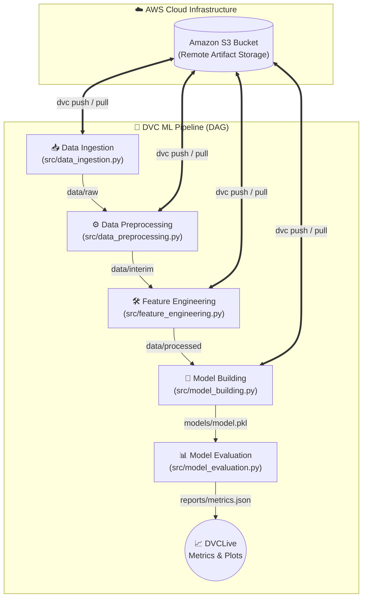

# 🚀 End-to-End Machine Learning Pipeline with DVC & AWS S3


A robust, scalable, and reproducible Machine Learning pipeline leveraging **Data Version Control (DVC)** for artifact tracking and **AWS S3** as a remote storage backend. This repository demonstrates production-grade practices for managing data, models, and experiments efficiently across different environments.

---

## 🏗️ Architecture & Pipeline Flow

The project follows a Directed Acyclic Graph (DAG) structured ML pipeline managed entirely by DVC. Below is the architectural flow illustrating the pipeline stages and their interaction with AWS S3.



## ✨ Key Features

- **Data & Model Versioning:** Tracks large datasets and model binaries using DVC, keeping Git lightweight.
- **Cloud Integration:** Seamlessly syncs artifacts with AWS S3 for distributed team collaboration.
- **Reproducibility:** Guarantees deterministic pipeline execution via `dvc.yaml` and `dvc.lock`.
- **Experiment Tracking:** Utilizes **DVCLive** to log metrics, parameters, and generate performance plots automatically.

---

## 📂 Project Structure

```text
.
├── .dvc/                   # DVC configuration and cache (Git ignored)
├── data/                   # Data directory (Tracked by DVC, ignored by Git)
│   ├── raw/                # Raw ingested data
│   ├── interim/            # Cleaned and preprocessed data
│   └── processed/          # Feature engineered data ready for modeling
├── models/                 # Trained ML models (Tracked by DVC)
├── src/                    # Source code for pipeline stages
│   ├── data_ingestion.py   # Stage 1: Load and split data
│   ├── data_preprocessing.py # Stage 2: Clean and format data
│   ├── feature_engineering.py# Stage 3: Transform and select features
│   ├── model_building.py   # Stage 4: Train the ML model
│   └── model_evaluation.py # Stage 5: Evaluate and log metrics
├── dvclive/                # DVCLive metrics, plots, and params tracking
├── dvc.yaml                # DVC pipeline DAG definition
├── params.yaml             # Centralized hyperparameters and configuration
└── README.md               # Project documentation
```

---

## 🛠️ Prerequisites

Ensure you have the following installed and configured:
- **Python 3.8+**
- **Git**
- **DVC** with S3 support (`pip install dvc[s3]`)
- **AWS CLI** configured with appropriate IAM credentials (`aws configure`)

---

## 🚀 Setup & Installation

1. **Clone the repository:**
   ```bash
   git clone https://github.com/Rupeshbhardwaj002/DVC-Full-Pipeline-with-AWS.git
   cd DVC-Full-Pipeline-with-AWS
   ```

2. **Create and activate a virtual environment:**
   ```bash
   python -m venv venv
   source venv/bin/activate  # On Windows: venv\Scripts\activate
   ```

3. **Install dependencies:**
   ```bash
   pip install -r requirements.txt
   ```

4. **Pull data and models from AWS S3:**
   ```bash
   dvc pull
   ```
   *This command authenticates with AWS S3 and downloads the tracked data (`data/`) and models (`models/`) required to run the project.*

---

## ⚙️ Pipeline Configuration (`params.yaml`)

Hyperparameters are centralized in `params.yaml` to allow easy experimentation without modifying code.

```yaml
data_ingestion:
  test_size: 0.30

feature_engineering:
  max_features: 50

model_building:
  n_estimators: 25
  random_state: 42
```

---

## 🔄 Running the Pipeline

To execute the entire pipeline from start to finish, run:

```bash
dvc repro
```

DVC is smart enough to determine which stages need to be re-run based on changes in code, data, or parameters. If nothing has changed, it will skip execution and use cached results.

---

## 📊 Experiment Tracking

This project uses **DVCLive** for tracking experiments. After running the pipeline, you can view the metrics and plots directly in your terminal or browser:

**Compare metrics across experiments:**
```bash
dvc metrics diff
```

**Generate and view HTML plots:**
```bash
dvc plots show
```

---

## ☁️ AWS S3 Integration

To push your local changes (new models, updated datasets) to the remote AWS S3 bucket:

1. **Run your experiments:** `dvc repro`
2. **Commit changes to Git:** `git add dvc.lock dvclive/ && git commit -m "Update model"`
3. **Push artifacts to S3:**
   ```bash
   dvc push
   ```

*Note: Ensure your AWS IAM user has `s3:PutObject`, `s3:GetObject`, and `s3:ListBucket` permissions for the target bucket.*

---

## 🤝 Contributing

Contributions are welcome! Please feel free to submit a Pull Request.
1. Fork the repository
2. Create your feature branch (`git checkout -b feature/AmazingFeature`)
3. Commit your changes (`git commit -m 'Add some AmazingFeature'`)
4. Push to the branch (`git push origin feature/AmazingFeature`)
5. Open a Pull Request

## 📄 License

This project is licensed under the MIT License - see the [LICENSE](LICENSE) file for details.
